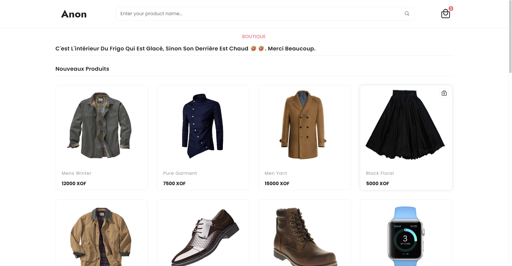

# Anon - eCommerce Website



Anon est un site de commerce électronique simple permettant aux utilisateurs de parcourir des produits, de les ajouter à leur panier et de consulter le contenu de leur panier. Ce projet utilise **PHP** et **MySQL** pour le backend, et **HTML/CSS** pour le frontend.

## Table des matières

- [Prérequis](#prérequis)
- [Installation](#installation)
- [Configuration](#configuration)
- [Utilisation](#utilisation)
- [Fichiers](#fichiers)
  - [index.php](#indexphp)
  - [add.php](#addphp)
  - [panier.php](#panierphp)
  - [anon.sql](#anonsql)
  - [con_dbb.php](#con_dbbphp)

## Prérequis

Avant de commencer, assurez-vous que votre environnement est configuré correctement. Vous aurez besoin des éléments suivants :

- Un serveur web comme **Apache** ou **Nginx** (inclus dans XAMPP, WAMP, LAMP, MAMP, etc.)
- PHP (version **7.3 ou supérieure**)
- Une base de données MySQL ou MariaDB
- phpMyAdmin (optionnel mais recommandé pour une gestion simplifiée de la base de données)

## Installation

1. **Téléchargez et installez un serveur web** :
   - [WAMP](https://www.wampserver.com/)
   - [XAMPP](https://www.apachefriends.org/index.html)
   - [MAMP](https://www.mamp.info/en/)

2. **Placez les fichiers du projet dans le répertoire racine de votre serveur web :**
   - Pour **WAMP**, placez le dossier du projet dans `C:\wamp\www\Anon`.
   - Pour **XAMPP**, placez-le dans `C:\xampp\htdocs\Anon`.
   - Pour **Linux (LAMP)**, utilisez `/var/www/html/Anon`.

3. **Importez la base de données :**
   - Démarrez MySQL et ouvrez phpMyAdmin.
   - Créez une nouvelle base de données nommée **anon**.
   - Importez le fichier `anon.sql` inclus dans le projet.

## Configuration

1. **Modifier les informations de connexion à la base de données**
   
   Ouvrez le fichier `con_dbb.php` et ajustez les paramètres si nécessaire :

   ```php
   <?php
   // Connexion à la base de données
   $con = mysqli_connect("localhost", "root", "", "anon");
   
   // Vérification de la connexion
   if (!$con) {
       die('Erreur de connexion : ' . mysqli_connect_error());
   }
   ?>
   ```

   - `localhost` : Adresse du serveur MySQL (généralement `localhost` en local).
   - `root` : Nom d’utilisateur MySQL (par défaut `root` sur XAMPP/WAMP).
   - `""` : Mot de passe MySQL (laisser vide si vous utilisez WAMP/XAMPP en local).
   - `anon` : Nom de la base de données.

## Utilisation

1. **Démarrez votre serveur web et votre base de données**
   - Si vous utilisez **WAMP/XAMPP**, ouvrez le panneau de contrôle et démarrez **Apache** et **MySQL**.

2. **Ouvrez votre navigateur et accédez au site :**

   ```
   http://localhost/Anon/index.php
   ```

   - Vous verrez la liste des produits disponibles.
   - Ajoutez des produits au panier et affichez son contenu.

## Fichiers

### `index.php`
Page principale qui affiche la liste des produits disponibles. L'utilisateur peut ajouter des produits à son panier.

### `add.php`
Ajoute un produit au panier en mettant à jour la session de l'utilisateur.

### `panier.php`
Affiche le contenu du panier avec les produits sélectionnés et permet de les supprimer.

### `anon.sql`
Fichier SQL contenant la structure et les données initiales de la base de données.

### `con_dbb.php`
Script de connexion à la base de données utilisé par toutes les pages PHP du projet.

---

Auteur : hwilson.tech

